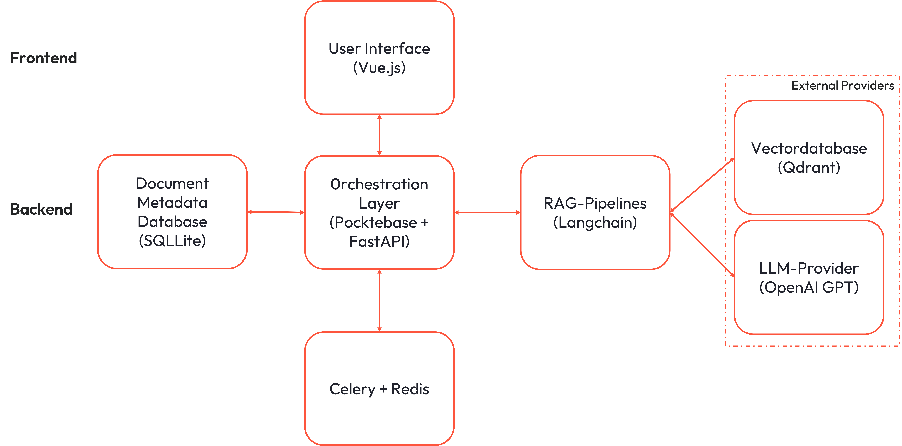
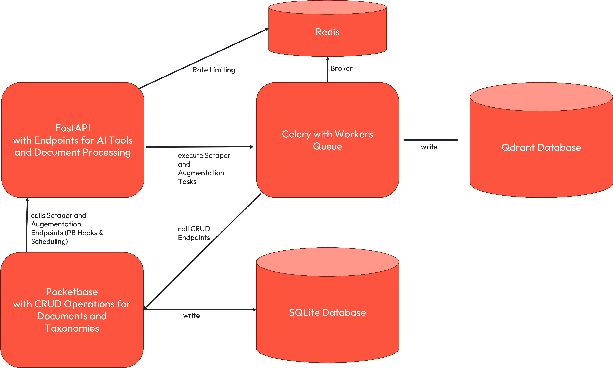

# Architecture

## Overview

Below are the key architectural diagrams showing the system's structure and data flow.

### System Architecture Overview

The NegotiateAI system consists of several key components working together to provide an AI-powered document analysis and negotiation platform:

- **Frontend (Vue.js + Vuetify)**: Web interface
- **FastAPI Backend**: RESTful API server handling AI processing, document queries, and business logic with rate limiting and async task processing
- **PocketBase**: Backend-as-a-service providing database management, authentication, file storage, and real-time API access. It comes with a SQLite Database.
- **Vector Database (Qdrant)**: Specialized storage for document embeddings enabling semantic search and AI-powered document retrieval
- **Celery Workers**: Asynchronous task processing for document augmentation, embedding generation, and background operations
- **Redis**: Message broker and caching layer supporting Celery task queues and rate limiting

## Backend Architecture

The following visualization shows the relation of the different components in the backend.

- **FastAPI Application**: The FastAPI application provides endpoints for AI tools and document processing, including document chunking and embedding operations.
- **PocketBase Integration**: PocketBase is our backend service that provides data management functionality. It includes a built-in SQLite database and offers comprehensive CRUD operations with advanced filtering capabilities for managing our application data.
- **Redis**: Redis serves as the message broker for Celery and handles rate limiting functionality.
- **Celery Task Queue**: Celery handles heavy background tasks that shouldn't run directly in the FastAPI application, such as data augmentation and resource-intensive extraction operations.
- **Vector Database (Qdrant)**: High-performance vector storage for document embeddings enabling semantic search and similarity matching
- **Qdrant server** Qdrant serves as our vector database for storing and querying document embeddings.

### Embedding and Augmentation Process 

When a new submission is created in the SQLite database with `verified=true` status and an attached file or if changed to this status, an automated embedding process is triggered to prepare the document for AI-powered search and analysis.

**Process Flow:**

1. **Database Trigger**: Two PocketBase event hooks monitor the submissions collection for new verified entries with file attachments or new created submissions.
2. **API Activation**: The hooks automatically calls a dedicated FastAPI endpoint to initiate document processing. 
3. **Document Processing**: The FastAPI service delay a job in celery to initialize the embedding of submissions. 
4. **Vectorization**: The celery job chunks the document content and generates vector embeddings using LangChain. The resulting embeddings are stored in the Qdrant vector database for semantic search capabilities. If the process is successful the job delays another celery task.
5. **Augmentation**: This celery job performs the augmentation of the data by leveraging an AI Tool. The extracted data is written to back to Pocketbase. 

**Technical Implementation:**

This automated workflow leverages PocketBase's event hook system (see [PocketBase Event Hooks Documentation](https://pocketbase.io/docs/js-event-hooks/)) to ensure real-time document processing without manual intervention.

- **Hook Configuration**: Located in `orchestration/pocketbase/pb_hooks/`
- **API Endpoints**: Document processing routes in `orchestration/fastapi/routers/`
- **Vector Operations**: LangChain-powered chunking and embedding in `orchestration/fastapi/vector_database/collections/`
- **AI Tools**: `orchestration/fastapi/src/tools/`

This event-driven architecture ensures that all verified documents are immediately available for AI-powered search and analysis within the NegotiateAI platform.